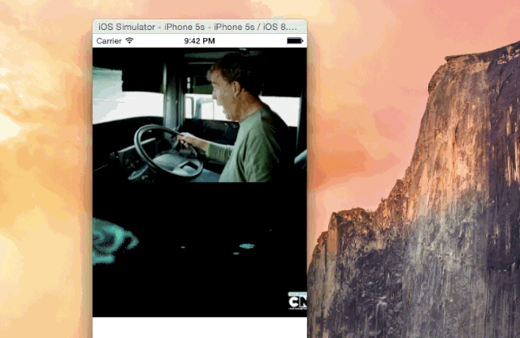

# SwiftGif [](https://developer.apple.com/swift/) [](https://github.com/Carthage/Carthage) [](http://cocoadocs.org/docsets/SwiftGifOrigin) [](https://github.com/Carthage/Carthage) [](https://travis-ci.org/bahlo/SwiftGif)

A small `UIImage` extension with gif support.



## Usage
Import the `Gif.swift` in your project and do the following:
```swift
// Returns an animated UIImage
let jeremyGif = UIImage.gifWithName("jeremy")

// Use the UIImage in your UIImageView
let imageView = UIImageView(image: jeremyGif)
```

## How does it work?
Easy, it does the following:

1. Find out the duration of every frame
2. Find the greatest common divisor
3. Add frames accordingly to the greatest common divisor to an array
4. Create an animated UIImage with the frames

# Inspiration
This project is heavily inspired by [uiimage-from-animated-gif](https://github.com/mayoff/uiimage-from-animated-gif).
Kudos to [@mayoff](https://github.com/mayoff). :thumbsup:

## License
This repository is licensed under the MIT license, more under
[LICENSE](LICENSE).

